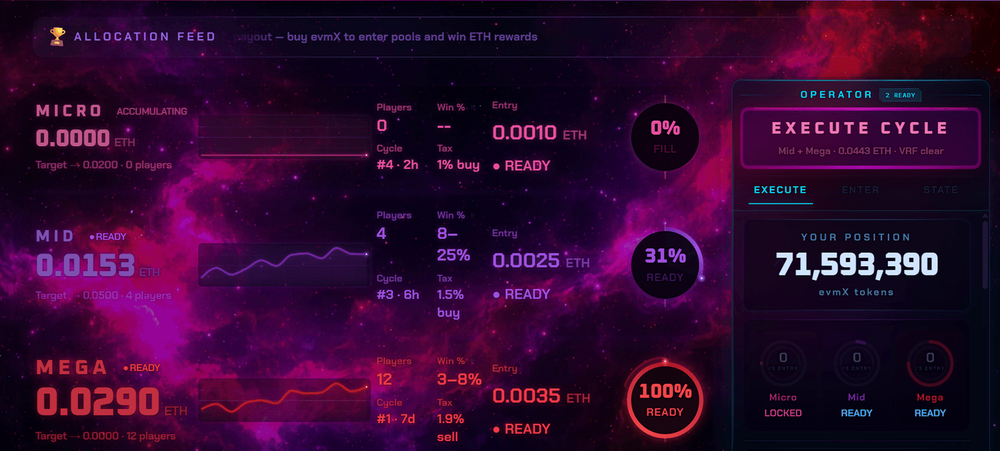
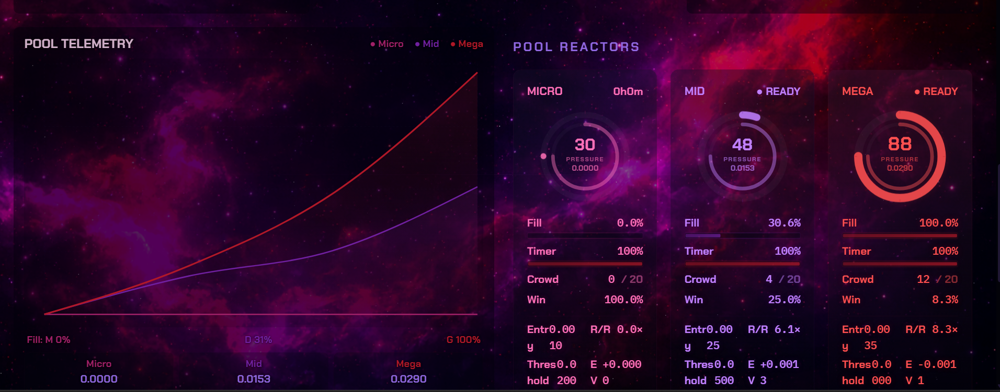

# evmX — Autonomous Multi-Cycle Reward Protocol

> **Three reward pools running at different speeds on Base L2. Buying builds participation, holding preserves position, Chainlink VRF picks the winner. No operator required.**

[](https://soliditylang.org/)
[](https://base.org/)
[](https://docs.chain.link/cre)
[](https://dashboard.tenderly.co/explorer/vnet/374547f2-47c6-4087-a785-507101cd004e/transactions)
[](#test-suite)
[](LICENSE)

**Convergence Hackathon 2026** | Tracks: **CRE & AI** + **Tenderly Virtual TestNets**

[**Demo Video**](https://youtu.be/hi5uvVxkVUA) | [**Tenderly Explorer**](https://dashboard.tenderly.co/explorer/vnet/374547f2-47c6-4087-a785-507101cd004e/transactions) | [**BaseScan**](https://sepolia.basescan.org/address/0x4AfdC83DC87193f7915429c0eBb99d11A77408d1)

### Current Status

| | |
|---|---|
| **Network** | Base Sepolia testnet — [`0x4Afd...8d1`](https://sepolia.basescan.org/address/0x4AfdC83DC87193f7915429c0eBb99d11A77408d1) |
| **Contract** | Deployed and verified on testnet — 174 tests passing |
| **Chainlink** | VRF v2.5 active · 3 CRE workflows configured · ETH/USD Data Feed |
| **Frontend** | React/TypeScript dashboard in `frontend/` — connected to Sepolia deployment |
| **Phase** | Pre-launch · mainnet deployment planned after hackathon evaluation |

### At a Glance

| | |
|---|---|
| **What** | 1,435-line ERC-20 with 3 reward pools at different speeds (2h / 6h / 7d), funded by buy/sell tax, winners selected via Chainlink VRF |
| **Dynamics** | Randomness decides who wins. Timing, entry building, and holding discipline determine how well you're positioned when it fires. |
| **Execution** | Dual-trigger: every trade checks pool conditions automatically + Chainlink CRE calls every 2 min as backup |
| **Post-launch** | Ownership renounced, LP burned, no proxy, no admin keys |

---

## Protocol Interface

The dashboard makes the three-cycle system legible in real time — surfacing pool state, entry pressure, crowding, readiness, and execution context so the protocol reads as a live operational system rather than a static token page.


*Three pool lanes with balances, fill gauges, participation counts, entry costs, and cycle readiness. The operator rail (right) shows execution state, position, and eligibility.*

With three overlapping cycles at different speeds, reading the system matters. The interface exposes fill trajectory, participation density, and trigger proximity — the factors that shape positioning decisions.


*Pool Telemetry tracks fill trajectory across all three pools. Pool Reactors show composite pressure scores — fill, timer, crowd density, win probability, and expected value.*

> Screenshots reflect the current build connected to the Base Sepolia test deployment. Displayed values are from that environment at capture time.

---

## How to Review This Repository

| Start here | What you'll find |
|------------|-----------------|
| **This README** | Protocol design, mechanics, proof points |
| [`contracts/evmX.sol`](contracts/evmX.sol) | Production smart contract — 1,435 lines |
| [`cre-workflow/`](cre-workflow/) | 3 Chainlink CRE workflows (TypeScript) |
| [`test/`](test/) | 174 tests — Foundry + Hardhat |
| [`frontend/`](frontend/) | React/TypeScript protocol dashboard |
| [Tenderly Explorer](https://dashboard.tenderly.co/explorer/vnet/374547f2-47c6-4087-a785-507101cd004e/transactions) | 60-transaction lifecycle demo — public, verified |
| [BaseScan](https://sepolia.basescan.org/address/0x4AfdC83DC87193f7915429c0eBb99d11A77408d1) | Live Base Sepolia deployment |

---

## Table of Contents

- [Three-Cycle Architecture](#three-cycle-architecture)
- [How Entry Works](#how-entry-works)
- [The Reflexive Loop](#the-reflexive-loop)
- [Autonomous Execution](#autonomous-execution)
- [Chainlink Integration](#chainlink-integration)
- [Tenderly Virtual TestNet](#tenderly-virtual-testnet)
- [Token Mechanics](#token-mechanics)
- [Adaptive Mechanics](#adaptive-mechanics)
- [Test Suite](#test-suite)
- [Security](#security)
- [Quick Start](#quick-start)
- [Project Structure](#project-structure)
- [Deployment](#deployment)
- [Roadmap](#roadmap)

---

## Three-Cycle Architecture

evmX runs three reward pools at different speeds. Each creates a different participation tempo and a different kind of decision around the same token.

| Pool | Cycle | Funded By | Character |
|------|-------|-----------|-----------|
| **Micro** | 2-hour Smart Ladder | 1% buy tax | Fast tactical cycle. Short windows. Timing pressure. Threshold 0.01–100 ETH — doubles on fast fill, halves on timeout. |
| **Mid** | 6-hour Smart Ladder | 1.5% buy tax | Medium cycle. More time to read pool state and weigh entry cost against crowding. Threshold 0.05–500 ETH. |
| **Mega** | Fixed 7-day cycle | 1.9% sell tax | Weekly cycle. Larger pot, longer positioning horizon. Fed by sell-side tax over the full week. |

These are not three prize buckets. They are three participation tempos around one token — each with distinct timing pressure and positioning dynamics.

**The structural distinction:**
- **Chainlink VRF determines the winner.** Provably fair, cryptographically verifiable. No party can predict or influence selection.
- **Positioning determines exposure.** Entry timing, cycle awareness, cumulative commitment, and holding discipline are the analyzable variables.

Winner selection is random. Positioning is not.

---

## How Entry Works

Eligibility and entries are separate concepts. Eligibility puts you in the participant set. Entries determine how many times your address appears in the draw.

### Eligibility

A wallet becomes eligible when its token holdings meet the dynamic entry requirement for that pool. This check runs during buys and can also be triggered via `reEnroll(address)`, which is permissionless.

### Entries (Buy-to-Play)

Entries come **only from actual buys** on Uniswap — not transfers, not re-enrollment. Each buy accumulates toward entry thresholds:

| Entry | Requirement |
|-------|------------|
| 1st | Any qualifying buy (while eligible) |
| 2nd | Cumulative buy value reaches 1× the pool's entry requirement |
| 3rd (max) | Cumulative buy value reaches 2× the pool's entry requirement |

Maximum 3 entries per cycle per pool. More entries = better odds.

### Dynamic Entry Requirements

Each pool's entry requirement = **0.7% of pool balance**, bounded by floors and caps:

| Pool | Floor | Cap |
|------|-------|-----|
| **Micro** | 0.001 ETH | 0.05 ETH |
| **Mid** | 0.0025 ETH | 0.25 ETH |
| **Mega** | 0.0035 ETH | 1 ETH |

Early in a cycle the entry cost is lower. As the pool accumulates, the cost rises.

### Holding and Revocation

At entry time, the contract calculates each user's **required token hold** from Uniswap reserves. This pegs the hold requirement to ETH value at entry — price movements afterward don't retroactively change it.

- **Selling revokes participation** across all three pools for current active cycles. If a pool has a pending VRF request, the next cycle is also affected.
- **Transferring below required hold** triggers automatic revocation for that pool and cycle.
- **Whale exclusion**: holders above 3% of supply are excluded from Micro — checked at entry and at winner selection.

---

## The Reflexive Loop

The protocol creates feedback between trading, pool growth, and participation:

```
Buy/sell activity → taxes feed pools → growing pools attract attention
    → new participants → new volume feeds pools further
```

Two reinforcing dynamics:
- **Holding incentive.** Selling revokes eligibility — participants positioned in a near-triggering pool have reason to hold.
- **Scaling entry barriers.** Larger pools require larger buys to enter, filtering low-commitment participation during high-activity periods.

This is a reflexive system, not a guarantee. Whether the loop sustains depends on real participation and real volume. The design creates conditions for reinforcement — it does not force outcomes.

---

## Autonomous Execution

After launch, ownership is permanently renounced and LP tokens are burned. No admin keys, no proxy, no upgrade path. The protocol runs on two independent trigger layers:

**Layer 1 — Trade triggers** (built into `_update()`): every buy/sell checks all 3 pools and triggers allocations when conditions are met. Active trading keeps the protocol running with zero external dependency.

**Layer 2 — CRE triggers** (via `runAutonomousCycle()`): Chainlink CRE calls every 2 minutes regardless of trading. This covers idle periods where a pool is ready but no one is trading.

| Scenario | Without CRE | With CRE |
|----------|:-----------:|:--------:|
| Active trading | Pools trigger via trade flow | Same — CRE is idle |
| No trades for 2+ hours | Micro pool stuck | CRE triggers it |
| No trades for 6+ hours | Mid pool stuck | CRE triggers it |
| No trades on Mega day 7 | Weekly reward sits idle | CRE triggers it |
| Token swap needed, no sells | Tokens accumulate | CRE runs swap |

| | Traditional DeFi | evmX |
|---|---|---|
| Admin key | Owner can pause/modify | Ownership renounced |
| Upgrade path | Proxy can change logic | No proxy — code is final |
| Keeper dependency | Bot must run 24/7 | CRE + trade triggers |
| Liquidity risk | Owner can pull LP | LP tokens burned |

> [!CAUTION]
> After renounce + LP burn, no party — including the deployer — can change parameters, drain funds, or halt reward cycles. The protocol operates as long as the underlying infrastructure (Base L2, Chainlink VRF, Uniswap V2) remains available.

---

## Chainlink Integration

evmX uses **3 Chainlink services**: CRE for autonomous execution, VRF for winner selection, Data Feeds for pricing.

| Service | Role | Location |
|---------|------|----------|
| **CRE Workflow #1** | Pool monitoring + cycle triggering (cron every 2 min) | `cre-workflow/.../evmx-autonomous-rewards/` |
| **CRE Workflow #2** | Event monitoring — `PoolAllocated` events via EVM Log Trigger | `cre-workflow/.../evmx-event-monitor/` |
| **CRE Workflow #3** | Strategy advisor — EVM read + CoinGecko + OpenAI LLM pipeline, local fallback | `cre-workflow/.../evmx-ai-advisor/` |
| **VRF v2.5** | Provably fair winner selection — native ETH, 3-block confirmations | `evmX.sol: fulfillRandomWords()` |
| **Data Feed** | ETH/USD pricing for frontend displays and analytics | `frontend/src/hooks/usePriceFeed.ts` |

<details>
<summary><b>CRE Workflow #1: Autonomous Rewards — code</b></summary>

```typescript
const onCronTrigger = (runtime: Runtime<Config>, _payload: CronPayload): string => {
  const evmClient = new EVMClient(BASE_SEPOLIA_SELECTOR)

  // Read all 3 pool states via EVM callContract
  const pools = [POOL_MICRO, POOL_MID, POOL_MEGA]
    .map(poolType => readPoolInfo(runtime, evmClient, poolType))

  // Check which pools are ready for allocation
  const readyPools = pools.filter(p => p && isPoolReady(p, currentTime))

  if (readyPools.length > 0) {
    evmClient.writeReport(runtime, { receiver, $report: true })
  }

  return `triggered for ${readyPools.length} pools`
}
```

</details>

<details>
<summary><b>CRE Workflow #3: AI Strategy Advisor — pipeline</b></summary>

Combines 3 data sources in a single CRE pipeline:

1. **EVM Read** — Pool states from the smart contract
2. **HTTP Client** — Real-time ETH market data from CoinGecko
3. **Confidential HTTP** — OpenAI GPT for strategy recommendation
4. **Fallback** — Local scoring algorithm (odds 40%, fill 30%, size 30%) if LLM is unavailable

```
CRE Cron (5min) → EVMClient.callContract() → HTTPClient (CoinGecko)
                → ConfidentialHTTPClient (OpenAI) → Strategy Report
```

</details>

### Price Feed Addresses

| Network | ETH/USD Feed |
|---------|-------------|
| Base Mainnet | `0x71041dddad3595F9CEd3DcCFBe3D1F4b0a16Bb70` |
| Base Sepolia | `0x4aDC67D868764F6022B3cD50e6dB3c7aaBc36578` |

### Files Using Chainlink

| File | Service | Usage |
|------|---------|-------|
| [`contracts/evmX.sol`](contracts/evmX.sol) | VRF v2.5 | `requestRandomWords()`, `fulfillRandomWords()`, emergency fallback, stale reroute |
| [`evmx-autonomous-rewards/index.ts`](cre-workflow/src/workflows/evmx-autonomous-rewards/index.ts) | CRE | Cron-triggered pool monitoring + cycle execution |
| [`evmx-event-monitor/index.ts`](cre-workflow/src/workflows/evmx-event-monitor/index.ts) | CRE | EVM Log Trigger on `PoolAllocated` events |
| [`evmx-ai-advisor/index.ts`](cre-workflow/src/workflows/evmx-ai-advisor/index.ts) | CRE | EVM read + HTTP + ConfidentialHTTP (OpenAI) pipeline |
| [`usePriceFeed.ts`](frontend/src/hooks/usePriceFeed.ts) | Data Feed | ETH/USD `AggregatorV3Interface` for real-time pricing |

---

## Tenderly Virtual TestNet

> **[Open Public Explorer](https://dashboard.tenderly.co/explorer/vnet/374547f2-47c6-4087-a785-507101cd004e/transactions)**

| | |
|---|---|
| **Network** | Base mainnet fork (Chain ID 8453) |
| **Contract** | `0x06eABc6937C02B073e568695Ca2526D10B23c68E` (verified) |
| **Base Sepolia** | [`0x4AfdC83DC87193f7915429c0eBb99d11A77408d1`](https://sepolia.basescan.org/address/0x4AfdC83DC87193f7915429c0eBb99d11A77408d1) |
| **Transactions** | 60 — deploy, liquidity, swaps, sells, pool accumulation, autonomous cycles, re-enrollment |

Full protocol on a real Base mainnet fork — same Uniswap V2 Router, same WETH, same VRF Coordinator as mainnet. Every transaction is publicly inspectable with full state traces.

---

## Token Mechanics

| Direction | Total Tax | Breakdown |
|-----------|-----------|-----------|
| **Buy** | 3% | Micro (1%) + Mid (1.5%) + Marketing (0.4%) + VRF (0.1%) |
| **Sell** | 3% | Mega (1.9%) + Marketing (1%) + VRF (0.1%) |

| Pool | Cycle | Threshold | Entry Requirement | Tax Source |
|------|-------|-----------|-------------------|------------|
| **Micro** | 2h / Smart Ladder | 0.01–100 ETH | 0.7% of pool (floor 0.001, cap 0.05 ETH) | 1% buy |
| **Mid** | 6h / Smart Ladder | 0.05–500 ETH | 0.7% of pool (floor 0.0025, cap 0.25 ETH) | 1.5% buy |
| **Mega** | Fixed 7-day | — | 0.7% of pool (floor 0.0035, cap 1 ETH) | 1.9% sell |

Additional constraints: 4% max wallet, 1.5% max transaction.

---

## Adaptive Mechanics

<details>
<summary><b>Smart Ladder — thresholds that adjust based on demand</b></summary>

Pool trigger thresholds adjust within defined ranges based on fill velocity:

| Condition | Action |
|-----------|--------|
| Pool fills before timer expires | Threshold doubles (up to max) |
| Timer expires before pool fills | Threshold halves (down to min) |

High volume → larger rewards before triggering. Quiet periods → faster triggers at smaller amounts. The protocol finds its own equilibrium.

</details>

<details>
<summary><b>Fallback systems</b></summary>

| Mechanism | Trigger | Action |
|-----------|---------|--------|
| **VRF Emergency Fallback** | VRF unresponsive for 24h | Commit-reveal on-chain entropy with 5-block delay |
| **VRF Stale Reroute** | Subscription unfunded 7 days | Pending ETH redistributes to reward pools |
| **VRF Funding Cap** | Subscription reaches 2 ETH | Excess flows back to pools |
| **Marketing Wallet Fallback** | Wallet rejects ETH | Funds redirect to Mega Pool |
| **Self-Healing Accounting** | Unexpected ETH arrives | `syncETHAccounting()` captures into Mega Pool |

</details>

<details>
<summary><b>Gas-aware operation</b></summary>

| System | Gas Reserve | Purpose |
|--------|-----------|---------|
| Recipient selection | 350,000 | Stops iteration if gas runs low |
| Allocation execution | 900,000 minimum | Won't start if insufficient gas |
| Entry cleanup | 30,000 batch limit | Incremental cleanup to avoid blocking |

</details>

<details>
<summary><b>Participant management</b></summary>

| Mechanism | How It Works |
|-----------|-------------|
| **Per-User Token Hold** | Minimum hold from Uniswap reserves at entry time — adapts to price at moment of entry |
| **Transfer Balance Check** | Dropping below required hold triggers automatic revocation |
| **Permissionless Re-enrollment** | `reEnroll(address)` — anyone can trigger eligibility re-check for any address |
| **Payout Failure Recovery** | If recipient can't receive ETH, next candidate is tried (up to 130 attempts) |
| **EOA Check at Selection** | `candidate.code.length > 0` — contract addresses excluded at selection |

</details>

---

## Test Suite

### 174 Tests — Dual Framework

| Category | Tests | Framework | Coverage |
|----------|------:|-----------|---------|
| **Attack Simulations** | 12 | Foundry | Reentrancy, flash loan, sandwich, MEV, gas grief, VRF manipulation |
| **Fuzz Testing** | 14 | Foundry | Random inputs (1000 runs each), boundary conditions |
| **Core Invariants** | 11 | Foundry | Supply conservation, ETH solvency, cycle validity |
| **Post-Renounce** | 2 | Foundry | Owner = address(0), marketing immutable |
| **Formal Properties** | 41 | Foundry | 12 stateful invariants + 29 property tests |
| **Edge Cases** | 26 | Foundry | 6 edge invariants + 20 boundary tests |
| **Economic Stress** | 15 | Foundry | 90% crash, 10× pump, mega cycle, liquidity drain |
| **Hardhat Local** | 28 | Hardhat | Unit tests, gas benchmarks, 50-bot stress test |
| **Base Mainnet Fork** | 25 | Hardhat | Real Uniswap V2, real WETH, real Base state |
| **Total** | **174** | | |

<details>
<summary><b>Mutation Testing</b></summary>

| Mutation | What broke | Caught by |
|----------|-----------|----------|
| Remove `buyAmountETH > 0` guard | Transfer/reEnroll grants entries | P38, G21, fuzz_reEnroll |
| `MAX_ENTRIES_PER_CYCLE` 3 → 255 | Unlimited entries | P40, fuzz_buyToPlay |
| `EMERGENCY_COMMIT_DELAY` 5 → 0 | No commit-reveal delay | P42 |

</details>

```bash
npm run test:full          # All 174 tests
npm run test:attacks       # Attack simulations
npm run test:fuzz          # Fuzz testing
npm run test:invariant     # Invariants
npm run test:economic      # Economic stress
npm run test:properties    # Formal properties
```

---

## Security

### 6-Phase Internal Assessment

| Phase | Scope |
|-------|-------|
| 1 | Structural analysis — control flow, access patterns, state transitions |
| 2 | Attack simulations — reentrancy, flash loan, sandwich, MEV, gas grief |
| 3 | Static analysis — invariant verification, formal properties |
| 4 | Economic stress — market crash, pump, liquidity drain |
| 5 | Edge case analysis — dust amounts, boundary values, timing |
| 6 | Deployment readiness — configuration review |

**Findings:** 0 critical, 2 high (external dependencies: VRF coordinator, L2 sequencer), 7 medium (design trade-offs, documented and accepted).

---

## Quick Start

```bash
git clone https://github.com/evmx-protocol/evmX.git
cd evmX
npm run setup    # Installs dependencies + runs all 174 tests
```

### Prerequisites

| Tool | Version | Install |
|------|---------|---------|
| Node.js | 18+ | [nodejs.org](https://nodejs.org) |
| Foundry | Latest | Auto-installed by setup |
| Bun | 1.2+ | [bun.sh](https://bun.sh) (for CRE) |
| CRE CLI | 1.0+ | [docs.chain.link](https://docs.chain.link/cre/getting-started/cli-installation/windows) |

### CRE Workflow Simulation

```bash
cd cre-workflow && bun install
bun run typecheck
cre workflow simulate ./src/workflows/evmx-autonomous-rewards --target local-simulation
```

---

## Project Structure

<details>
<summary><b>Click to expand</b></summary>

```
evmX/
├── contracts/
│   ├── evmX.sol                    # Production contract (1,435 lines)
│   ├── evmX_Testable.sol           # Test variant (injectable dependencies)
│   └── mocks/                      # Mock contracts for testing
├── cre-workflow/
│   └── src/workflows/
│       ├── evmx-autonomous-rewards/  # Workflow #1: Pool monitoring + trigger
│       ├── evmx-event-monitor/       # Workflow #2: Event processing
│       └── evmx-ai-advisor/         # Workflow #3: Strategy advisor
├── test/
│   ├── foundry/                    # 121 Foundry tests
│   │   ├── attacks/                #   12 exploit simulations
│   │   ├── fuzz/                   #   14 fuzz tests
│   │   ├── invariant/              #   80 invariant + formal + edge tests
│   │   └── state_machine/          #   15 economic stress tests
│   ├── LaunchStress.test.js        # 28 Hardhat local tests
│   └── evmX_BaseFork.test.js       # 25 Base mainnet fork tests
├── frontend/                       # React/TypeScript protocol dashboard
│   ├── src/
│   │   ├── App.tsx                 # Main dashboard layout
│   │   ├── components/protocol/    # Pool lanes, operator rail, AI advisor
│   │   ├── components/system/      # Canvas background, gauges, bars
│   │   ├── hooks/                  # Contract data, wallet, VRF, trades
│   │   ├── lib/                    # Types, ABI, utils
│   │   └── config/                 # Chain + contract addresses
│   └── index.html
├── scripts/                        # Setup, deploy, demo scripts
├── hardhat.config.js
├── foundry.toml
└── package.json
```

</details>

---

## Deployment

```bash
npm run deploy:tenderly    # Tenderly VNet + auto-verify
npm run demo:tenderly      # Full lifecycle demo
npm run deploy:sepolia     # Base Sepolia testnet
npm run deploy:base        # Base Mainnet (post-launch)
```

**Current deployment** — Base Sepolia:

| Parameter | Value |
|-----------|-------|
| Chain ID | 84532 |
| Contract | [`0x4AfdC83DC87193f7915429c0eBb99d11A77408d1`](https://sepolia.basescan.org/address/0x4AfdC83DC87193f7915429c0eBb99d11A77408d1) |
| Compiler | Solidity 0.8.28, via IR, 50 optimizer runs |

**Target mainnet** — Base L2:

| Parameter | Value |
|-----------|-------|
| Chain ID | 8453 |
| Uniswap V2 Router | `0x4752ba5DBc23f44D87826276BF6Fd6b1C372aD24` |
| VRF Coordinator | `0xd5D517aBE5cF79B7e95eC98dB0f0277788aFF634` |

---

## Roadmap

### Phase 1: Hackathon (Current)
- [x] Smart contract finalized — 1,435 lines, 174 tests
- [x] Deployed to Base Sepolia with Chainlink VRF v2.5
- [x] 3 CRE Workflows — Autonomous Rewards + Event Monitor + AI Advisor
- [x] React/TypeScript protocol dashboard
- [x] 6-phase security assessment
- [x] Tenderly Virtual TestNet — 60 tx lifecycle demo

### Phase 2: Mainnet Launch
- [ ] 60% to Uniswap V2 liquidity (LP burned), 40% for development
- [ ] Ownership renounced immediately after launch
- [ ] CRE Workflows deployed to production
- [ ] VRF subscription funded

### Phase 3: Autonomous Operation
- [ ] Protocol runs without human intervention
- [ ] CRE ensures 24/7 execution coverage
- [ ] Community growth driven by reward mechanics

---

## Tech Stack

| Component | Technology |
|-----------|-----------|
| Smart Contract | Solidity 0.8.28, OpenZeppelin, Hardhat + Foundry |
| CRE Workflows | TypeScript, @chainlink/cre-sdk, Bun |
| Randomness | Chainlink VRF v2.5 (native ETH) |
| Execution | Chainlink CRE |
| Price Data | Chainlink Data Feed (ETH/USD) |
| Frontend | React 19, TypeScript, ethers.js v6, Tailwind CSS, Recharts |
| Network | Base L2 (Sepolia testnet / mainnet target) |
| Testing | Tenderly Virtual TestNet (Base fork) |
| DEX | Uniswap V2 |

---

## Source Availability

This repository is source-available under the included [LICENSE](LICENSE) for review, audit, and evaluation — including hackathon judging. A transition to an open-source license is planned after mainnet launch. Until that change is made, the current LICENSE governs all use rights.

| Permission | Status |
|-----------|--------|
| View, read, audit | ✓ Permitted |
| Compile and run tests locally | ✓ Permitted |
| Hackathon evaluation | ✓ Permitted |
| Deploy, fork, or redistribute | ✗ Requires written permission |
| Commercial use | ✗ Requires written permission |

See [LICENSE](LICENSE) for full terms.

---

**evmX** — Built with Chainlink CRE + VRF + Data Feeds on Base L2
